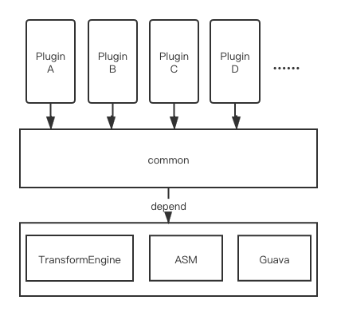

**[English](README.md)** | 简体中文


# ByteX（Infinite Possibilities）


<h1 align="center">
  
 </h1>

[](https://bintray.com/tellh/maven/common/_latestVersion) [](https://github.com/bytedance/ByteX/blob/master/LICENSE)

> 本工具由字节跳动抖音 Android 团队提供。

ByteX是一个基于gradle transform api和ASM的字节码插件平台（或许，你可以把它当成一个有无限个插头的插座？）。


目前集成了若干个字节码插件，每个插件完全独立，既可以脱离ByteX这个宿主而独立存在，又可以自动集成到宿主和其它插件一起整合为一个单独的Transform。插件和插件之间，宿主和插件之间的代码是完全解耦的（有点像组件化），这使得ByteX在代码上拥有很好的可拓展性，新插件的开发将会变得更加简单高效。

### 背景

如果所有feature都开发一个单独的插件，每个插件编译构建耗时+10s，各个插件叠在一起，编译耗时就会呈线性增长；那如果我们所有feature都基于一个现成的字节码插件做迭代开发，又会让插件代码变得越来越臃肿，代码耦合严重。所以就有了这个想法，单独做一个字节码插件开发平台，新的feature可以基于它做扩展。

### 特点

- 代码复用。公共的代码下沉下到common，给所有插件复用，这样每个插件就只需要专注于字节码插桩就行了。

- 插件间代码隔离，相互解耦。之前字节码的相关feature都是基于某个字节码插件module来迭代扩展的，但各个feature的代码耦合在一起，久而久之这个插件module就成为了大杂烩。而基于ByteX，各个feature都独立成一个个插件，各个feature的代码相互隔离，相互独立，有利于新插件的功能拓展。

- 平台化让transform更高效。

  - class文件多线程并发处理，充分利用打包机的CPU资源。

  - 插件间自动无缝地整合成一个Transform，提高处理构建的效率。Transform过程中，对class文件的IO是比较耗时的，把所有的plugin整合成一个单独transform可以避免打包的额外时间开销呈线性增长。让耗时从1+1=2，变成1+1<2或者约等于1。

- 插件移植性强。每个插件都可以脱离ByteX宿主，独立成一个transform，独立工作。

### 项目结构




**TransformEngine**

负责遍历读取工程和Android SDK里的所有class文件，并回写到transform指定目录。

**base-plugin**

宿主，也就一个壳。

**common**

基础代码库，包括类图构建逻辑，日志，提供给各个插件的适配接口等。

**其它插件module**

依赖common，实现相应的接口和各自的字节码插桩逻辑。


## 快速接入

在build.gradle里添加以下配置，按需apply你的插件：

```groovy
buildscript {
    ext.plugin_version="0.1.0"
    repositories {
        maven { url "https://dl.bintray.com/tellh/maven" }
        google()
        jcenter()
    }
  
    dependencies {
        classpath "com.bytedance.android.byteX:base-plugin:${plugin_version}"
      	// Add bytex plugins' dependencies on demand. 按需添加插件依赖
        classpath "com.bytedance.android.byteX:refer-check-plugin:${plugin_version}"
      	// ...
    }
}

apply plugin: 'com.android.application'
// apply ByteX宿主
apply plugin: 'bytex'
ByteX {
    enable true
    enableInDebug false
    logLevel "DEBUG"
}

// 按需apply bytex 插件
apply plugin: 'bytex.refer_check'
// ...
```

注意：如果不apply ByteX宿主，那么这些ByteX插件与普通的插件无异，将会各自形成单独的Transform。反之，所有ByteX的插件将会自动融合成一个Transform。

以下是基于ByteX开发的插件，可以进入各个插件的README.md了解插件的接入方式。

## 已集成的插件

- [access-inline-plugin](access-inline-plugin/README-zh.md)（access方法内联）
- [shrink-r-plugin](shrink-r-plugin/README-zh.md)（R文件瘦身和无用资源检查）
- [closeable-check-plugin](closeable-check-plugin/README-zh.md)（文件流的close检查）
- [const-inline-plugin](const-inline-plugin/README-zh.md)（常量内联）
- [field-assign-opt-plugin](field-assign-opt-plugin/README-zh.md)（优化多余赋值指令）
- [getter-setter-inline-plugin](getter-setter-inline-plugin/README-zh.md) （getter和setter方法内联）
- [method-call-opt-plugin](method-call-opt-plugin/README-zh.md)（干净地删除某些方法调用，如`Log.d`）
- [coverage-plugin](coverage/README-zh.md)（线上代码覆盖率）
- [refer-check-plugin](refer-check-plugin/README-zh.md)（检查是否有调用不存在的方法和引用不存在的字段）
- [serialization-check-plugin](serialization-check-plugin/README-zh.md)（序列化检查）
- [SourceFileKiller](SourceFileKiller/README.md)（删除SourceFile和行号属性）

## 已知接入方
<!---->
<!---->
<!---->
<!---->
<!--<br/>-->
<!---->
<!---->
<!---->
<!---->


## Contribution

如果你有一些关于字节码的相关需求或脑洞，完全可以基于ByteX来开发新的字节码插件。

请参考研发WIKI：[Developer API](wiki/ByteX-Developer-API-zh.md)


## License

Apache 2.0
