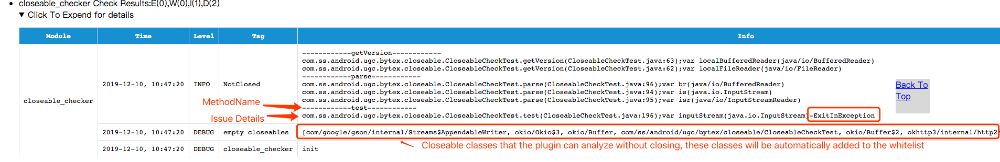
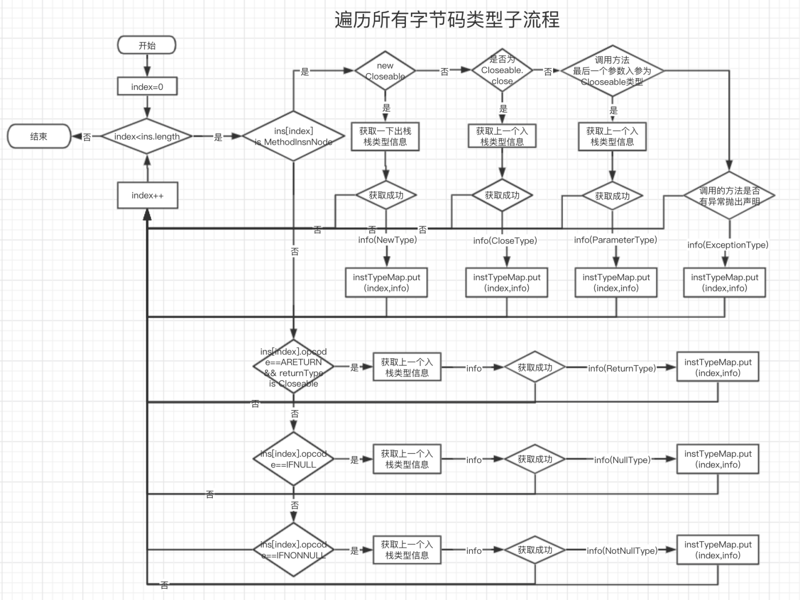
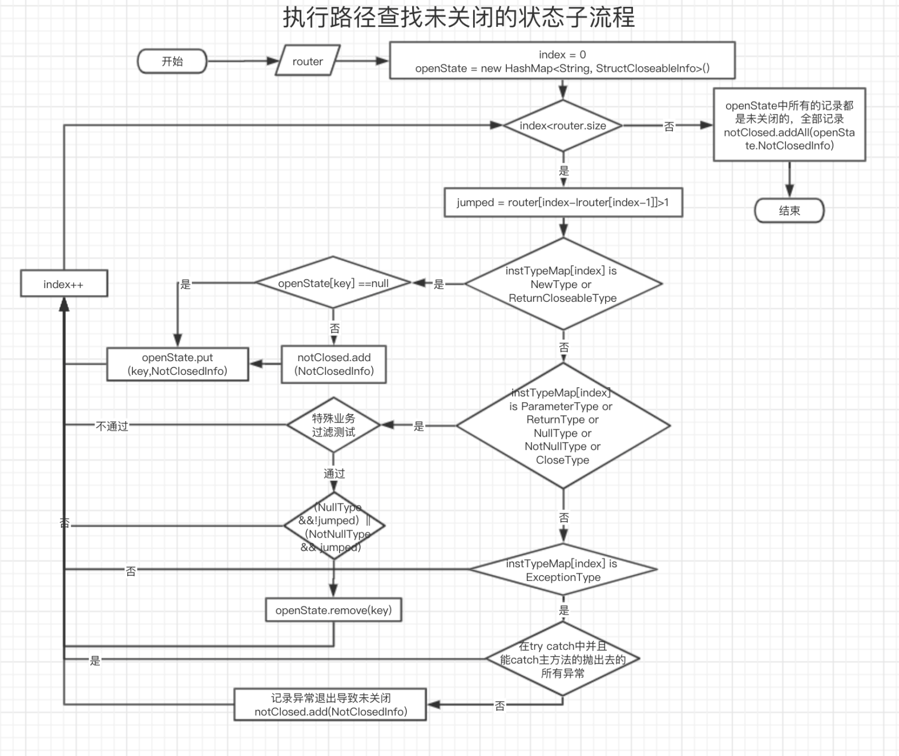

[English](README.md) | **[简体中文](README-zh.md)**
## 功能
&nbsp;&nbsp;&nbsp;&nbsp;&nbsp;&nbsp;编译期间检查项目中closeable对象(比如FileInputStream等实现了Closeable接口的类)可能存在的未关闭(未调用close方法)的代码

## 原理
&nbsp;&nbsp;&nbsp;&nbsp;&nbsp;&nbsp;扫描项目中所有的代码中的每一个方法，根据字节码的操作内容，判断每一条指令对应是否为打开closeable对象的指令、new closeable对象的指令、关闭closeable对象的指令、会抛出异常的指令、异常处理块、closeable对象判空、返回closeable对象等场景。根据指令(跳转)分析所有可能执行路径，分析路径上有打开但没有关闭的情况(未关闭)、打开到关闭上有抛异常的情况(异常退出方法)的问题并进行记录上报。

## 接入方式
* 添加插件classpath

  >classpath "com.bytedance.android.byteX:closeable-check-plugin:${plugin_version}"
* 在application的build.gradle中apply插件并配置

    ```groovy
    apply plugin: 'bytex.closeable_checker'
    closeable_checker {
            enable true//整体开关
            enableInDebug true//debug模式开关
            ignoreWhenMethodParam = true//是否对传递closeable对象的函数调用认作close处理，开启此开关将会漏检一些未关闭的情况。此开关建议视情况而定。
            ignoreAsReturn = true//closeable作为返回值时忽略未关闭的状态。强烈建议开
            ignoreField = true//closeable作为成员变量时忽略未关闭的状态。建议开启
            ignoreMethodThrowException = true//如果方法可能会抛出异常，则可能会认定未关闭。建议开启
            strictMode = true//严格模式检查。对于只是在正常代码执行情况下关闭的操作是否认定为正确关闭。建议开启。
            logLevel "DEBUG"
            onlyCheckList=[
               //只检查的包名，如果为空则检查项目中的所有class，如果有指定则只检查指定包下面的class
                    "com/ss/*"     
            ]
            whiteList = [
                    //滤过检查的类 格式为 类名#方法名#方法签名  支持模式匹配
                    "android*",
                    "kotlin*",
                    "java*"
            ]
            closeableList = [
                    //就要检查的类，包含其子类,不支持模式匹配
                    "java/io/InputStream",
                    "java/io/OutputStream",
                    "java/io/PrintStream",
                    "java/io/Writer",
                    "java/io/Reader",
                    "java/io/RandomAccessFile",
                    "java/nio/file/FileSystem",
                    "android/database/Cursor",
                    "java/util/zip/ZipFile",
                    "android/database/sqlite/SQLiteClosable",
                    "okhttp3/Response",
                    "android/media/MediaDataSource",
                    "java/net/MediaDataSource",
                    "android/net/LocalSocket",
                    "okio/Sink",
                    "okio/Source",
                    "okio/UnsafeCursor",
                    "java/nio/channels/Selector",
                    "android/arch/persistence/db/SupportSQLiteProgram"
            ]
            excludeCloseableList = [
                    //排除需要检查的类，和closeableList相似，此处不包含子类
                    //该列表中的类虽然也是closeable的子类，但这些类都是内存级别的操作，不存在
                    //资源泄露的可能，可以忽略关闭.
                    "java/io/StringReader",
                    "java/io/StringWriter",
                    "java/io/ByteArrayOutputStream",
                    "java/io/ByteArrayInputStream",
            ]
    }
    ```
## 查看检查结果<br/>
&nbsp;&nbsp;&nbsp;&nbsp;&nbsp;&nbsp;检查结果默认将会放在对应的`app/build/ByteX/ByteX_report_ByteX.html`中，类似下图:<br/>


## 分析流程
- 1、使用Byte传递过来的基于ASM库读取MethodVisitor回调(每一给方法有一个MethodVisitor)，记录该方法所有的指令。
- 2、判断所有指令中是否有Closeable相关的操作，没有的话可以快速结束该方法的分析扫描。(加快扫描速度)
- 3、遍历该方法的所有指令，对每一个指令进行标记类型，标记的类型包含
     * ReturnCloseableType：方法调用返回了Closeable对象
     * NewType:创建了一个Closeable对象
     * NullType:一条Null判断指令(用于过滤Closeable判断空路径)
     * NotNullType:一条NotNull判断指令(用于过滤Closeable判断空路径)
     * ParameterType:Closeable作为参数传递
     * ExceptionType:普通方法调用但带有异常标识
     * ReturnType:Closeable对象作为返回值
- 4、利用Asm的FlowAnalyzer对所有指令的读取回调，分析所有的执行路径。
- 5、分析每一条执行路径执行的所有的指令:对ReturnCloseableType或NewType操作记录为打开操作，如果之前已经记录了该位置为已经打开，但未记录到关闭(循环体中无关闭打开);对NullType和NotNullType做对应路径的丢弃处理，因为closeable对象为空时不需要关闭;对CloseType作为关闭操作,对ParameterType、ReturnType视情况判断为关闭(特殊业务逻辑),关闭时移除对应的打开操作表示正常关闭。对ExceptionType作异常判断，判断是否有对应的catch代码能catch住，如果不能，记录异常退出未关闭情况.
- 6、对打开记录状态进行判断，记录中未移除的打开操作的都是没有关闭地方。
- 7、将分析结果输出到结果日志中，分析结束.

### 整体流程图

### 指令标记流程图

### 路由遍历流程图


## 缺陷与不足
&nbsp;&nbsp;&nbsp;&nbsp;&nbsp;&nbsp;由于closeable对象在代码中使用复杂，比如存在传递调用，跨方法调用分析的复杂度会变得非常高，所以仅仅分析单个方法内的指令，对某些场景加以假设，检查方案本身存在一定的缺陷，所以存在一定的误报、漏报问题。但经过抖音项目的测试，准确率能有40%左右，剩下的工作需要开发自己判断是否需改。如果是误报，可以在上面的配置`whiteList`添加白名单.