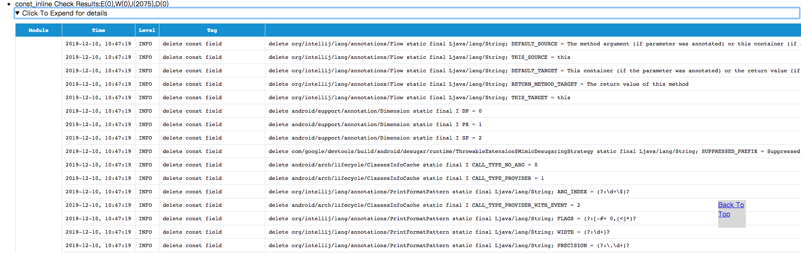

[English](README.md) | **[简体中文](README-zh.md)**
## 功能
&nbsp;&nbsp;&nbsp;&nbsp;&nbsp;&nbsp;编译期间内联并优化掉项目中的编译期间常量字段
## 原理
&nbsp;&nbsp;&nbsp;&nbsp;&nbsp;&nbsp;常量字段是指运行期间不会改变的字段，对于其赋值之后，其值是固定不变的(反射或者直接修改内存除外)。常量可以分为以下两种

* **编译期常量**:在编译期间就可以确定的值的常量，或者说在字节码里面含有ConstantValues属性的field
	>比如:public static final String TAG = “MainActivity”;
	
* **运行期间常量**:需要在运行的时候初始化才能确定值的常量，该常量相对于编译期常量的一个特殊点是存在对应PUTSTATIC指令进行赋值。
	>比如:public static final String TAG = MainActivity.class.getSimpleName();

&nbsp;&nbsp;&nbsp;&nbsp;&nbsp;&nbsp;插件将对编译期常量的运算(对应GETFIELD指令)进行内联操作(对应LDC指令)，然后将对应的字段进行删除优化。插件会对可能的反射的代码进行分析，对于直接使用反射方式获取运行时常量字段进行忽略优化处理。
## 接入方式
* 添加插件classpath

  >classpath "com.bytedance.android.byteX:const-inline-plugin:${plugin_version}"
* 在application的build.gradle中apply插件并配置

	```groovy
    apply plugin: 'bytex.const_inline'
    const_inline {
            enable true
            enableInDebug true
            logLevel "INFO"
            autoFilterReflectionField = true  //使用插件内置的反射检查过滤掉可能的反射常量，建议为true
            //supposesReflectionWithString = false //使用插件内置字符串匹配可能反射常量，建议为false
            skipWithRuntimeAnnotation true //过滤掉带有运行时注解的常量，推荐true
            skipWithAnnotations = [
                    //过滤掉被注解注释过的常量，包含class
                    "android/support/annotation/Keep",
            ]
            whiteList = [
                    //跳过优化的名单
                    "com/meizu/cloud/*",
            ]
    }
    ```
## 优化效果
&nbsp;&nbsp;&nbsp;&nbsp;&nbsp;&nbsp;抖音减少85000+个常量字段，减少包体积200KB+<br/>
&nbsp;&nbsp;&nbsp;&nbsp;&nbsp;&nbsp;优化效果默认将会放在对应的`app/build/ByteX/ByteX_report_ByteX.html`中，类似下图:<br/>
