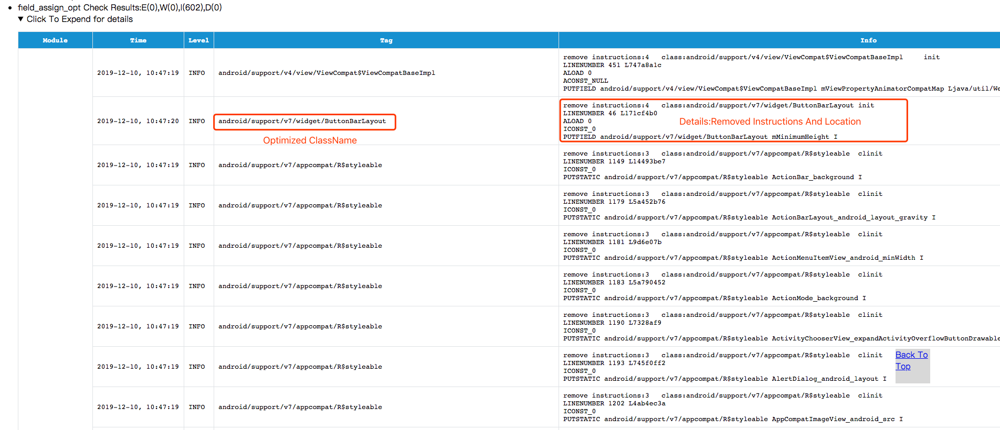

**[English](README.md)** | [简体中文](README-zh.md)
## Feature
&nbsp;&nbsp;&nbsp;&nbsp;&nbsp;&nbsp;Shrink unnecessary or duplicate field assignment (default value) from code during compilation
## Principle
&nbsp;&nbsp;&nbsp;&nbsp;&nbsp;&nbsp;Fields in the class (including static fields and member fields) are given default values ​​by default in the memory allocated when the virtual machine is instantiated（[Official Virtual Machine Specification](https://docs.oracle.com/javase/specs/jvms/se7/html/jvms-2.html#jvms-2.3)).However, developers still often write code that assigns default initial values ​​to fields. These default value assignment instructions will be in the corresponding constructor (member field) or class code block (static field). These assignments are redundant, and the plugin will Analyze this class of assignment instructions and optimize them.<br/>
&nbsp;&nbsp;&nbsp;&nbsp;&nbsp;&nbsp;Optimized scenarios include the following：

- Attach the default value directly where the field is declared

	```java
    private boolean aBoolean = false;
    private byte aByte = 0;
    private short aShort = 0;
    private char aChar = '\u0000';
    private int anInt = 0;
    private float aFloat = 0f;
    private double aDouble = 0d;
    private long aLong = 0l;
    private Object aObject = null;
	```
	
- Make default value assignment code for fields in constructor or static block.

	```java
    class MyTestClass{
        private static int sInt;
        private int mInt;
        static {
            sInt = 0;//delete
            sInt = 0;//delete
            sInt = 1;
            sInt = 0;//not delete
            sInt = 0;//not delete
        }
        public MyTestClass(Object any){
            this();
            mInt = 0;//not delete
            sInt = 0;//not delete
        }
        public MyTestClass(){
            mInt = 0;//delete
            mInt = 0;//delete
            mInt = 1;
            mInt = 0;//not delete
            mInt = 0;//not delete
            
            sInt = 0;//not delete
            sInt = 1;//not delete
        }
    }
	```
## Quick Start
* add build classpath

  >classpath "com.bytedance.android.byteX:field-assign-opt-plugin:${plugin_version}"

* apply and configure the plugin in your build.gradle(application)

	```groovy
    apply plugin: 'bytex.field_assign_opt'
    field_assign_opt {
            enable true
            enableInDebug false
            logLevel "INFO"
            removeLineNumber true //remove the corresponding line number information（if exist）,true is recommended。
            whiteList = [
                    //ClassName.FieldName 
                    //"android.support.constraint.solver.ArrayRow.isSimpleDefinition"
            ]
    }
    ```
    
## Optimization Results
&nbsp;&nbsp;&nbsp;&nbsp;&nbsp;&nbsp;More than 8000 constant fields are cut down from Douyin apk, resulting in more than 200KB slimmer than not.<br/>
&nbsp;&nbsp;&nbsp;&nbsp;&nbsp;&nbsp;The optimized result will be printed into the corresponding `app/build/ByteX/ByteX_report_ByteX.html` by default.The result may look like the picture showed below:<br/>
