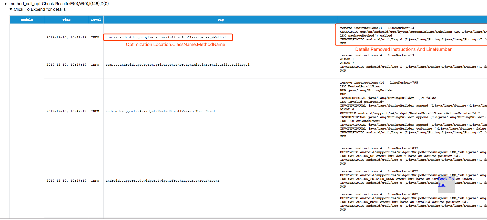
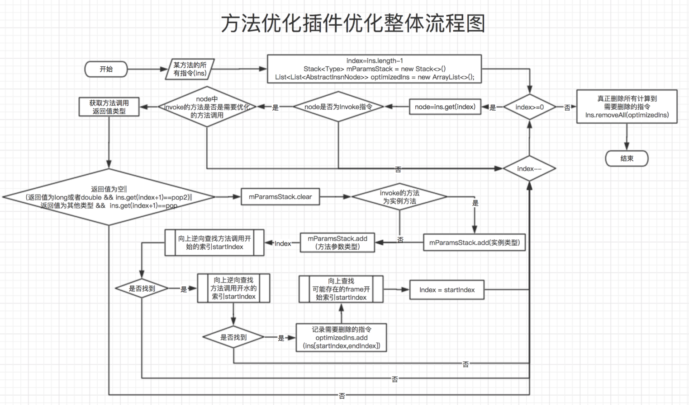
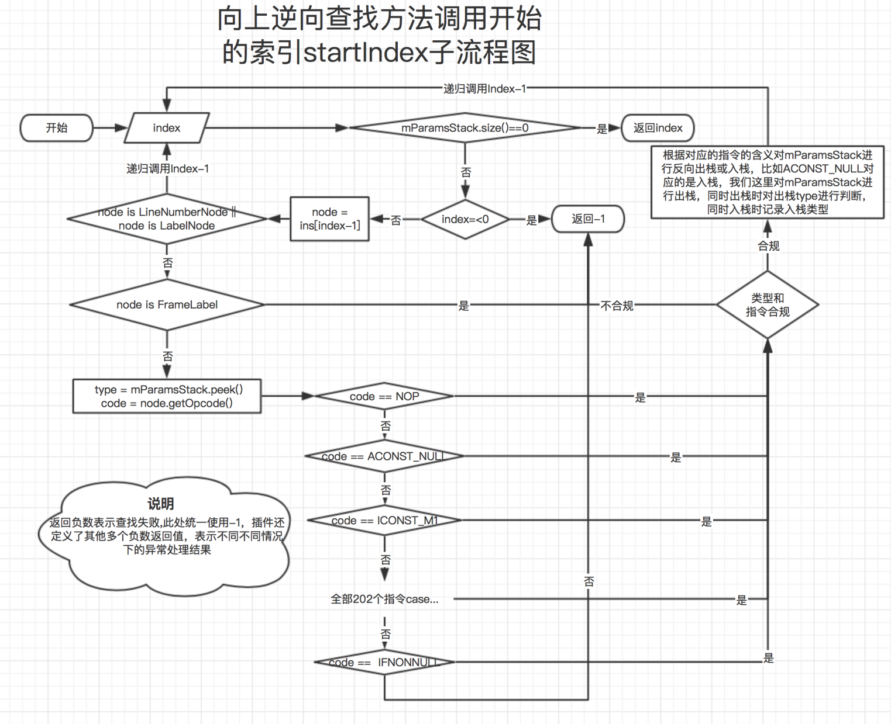
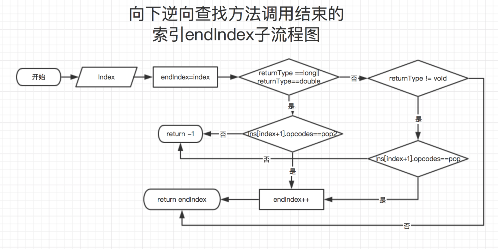

[English](README.md) | **[简体中文](README-zh.md)**
## 功能
&nbsp;&nbsp;&nbsp;&nbsp;&nbsp;&nbsp;根据配置，编译期间优化掉项目所有调用了配置中配置的方法调用(包含参数形成指令)

比如Log或者封装的Logger方法
```java
public class Example {
    private void test() {
        //do something
        try{
            Log.d("Example","startString"+new StringBuilder().append("thisonee").append("thatone").append(this.getClass().getName()).append("\n")+"endString");
        }catch (Exception e){
            Logger.e(e);
        }
        //do something
    }
}

//after optimization
//需要配置 Log.d 和Looger.e
public class Example {
    private void test() {
        //do something
        try{
        }catch (Exception e){
        }
        //do something
    }
}

``` 
## 为什么不用Proguard
proguard可以使用`-assumenosideeffects`来配置无效调用，但其原理是通过删除调用指令，然后使用pop来平衡操作数栈实现，理论上会遗留下参数的生成过程的指令，同样的上面的示例代码，如果使用proguard之后的效果后会是如下效果:
```java
public class Example {
    private void test() {
        //do something
        try{
            //此处特意把LDC的常量显示出来是因为优化本来会留下这些符号，这个可以再叠加其他指令优化做到删除。反编译apk依然能看到这些参数信息的代码。
            "Example";
            "startString"+new StringBuilder().append("thisonee").append("thatone").append(this.getClass().getName()).append("\n")+"endString";
        }catch (Exception e){
            e;
            
        }
        //do something
    }
}

```

## 接入方式
* 添加插件classpath

  >classpath "com.bytedance.android.byteX:method-call-opt-plugin:${plugin_version}"
* 在application的build.gradle中apply插件并配置

	```groovy
	apply plugin: 'bytex.method_call_opt'
	method_call_opt {
    	enable true //建议开发模式关闭
    	enableInDebug false
    	logLevel "DEBUG"
    	//是否在log中显示删除方法调用指令后的方法指令，一般调试时使用
    	showAfterOptInsLog false
    	//需要删除的方法配置
    	methodList = [
            //下面的每一项配置必须严格按照数据配置，一个地方不对这一项不生效。
            //class#method#desc
            "android/util/Log#v#(Ljava/lang/String;Ljava/lang/String;)I",
            "android/util/Log#v#(Ljava/lang/String;Ljava/lang/String;Ljava/lang/Throwable;)I",
            "android/util/Log#d#(Ljava/lang/String;Ljava/lang/String;)I",
            "android/util/Log#d#(Ljava/lang/String;Ljava/lang/String;Ljava/lang/Throwable;)I",
            "android/util/Log#i#(Ljava/lang/String;Ljava/lang/String;)I",
            "android/util/Log#i#(Ljava/lang/String;Ljava/lang/String;Ljava/lang/Throwable;)I",
            "android/util/Log#w#(Ljava/lang/String;Ljava/lang/String;)I",
            "android/util/Log#w#(Ljava/lang/String;Ljava/lang/String;Ljava/lang/Throwable;)I",
            "android/util/Log#e#(Ljava/lang/String;Ljava/lang/String;)I",
            "android/util/Log#e#(Ljava/lang/String;Ljava/lang/String;Ljava/lang/Throwable;)I",
            "android/util/Log#println#(ILjava/lang/String;Ljava/lang/String;)I",

            "java/lang/Throwable#printStackTrace#()V",
            "com/google/devtools/build/android/desugar/runtime/ThrowableExtension#printStackTrace#(Ljava/lang/Throwable;)V"
            
            //还有自己项目中封装的Logger方法
    	]
    	onlyCheckList = [
	        //"com/ss/*",
	        //"com/bytedance/*"
    	]

    	whiteList = [
            "com/facebook/stetho*",
    	]
	}
	```
	
## 优化效果
&nbsp;&nbsp;&nbsp;&nbsp;&nbsp;&nbsp;抖音减少12000+处调用，减少包体积200+KB(如果开启Kotlin的判空优化，将再有300KB的优化)<br/>
&nbsp;&nbsp;&nbsp;&nbsp;&nbsp;&nbsp;优化结果默认将会放在对应的`app/build/ByteX/ByteX_report_ByteX.html`中，会将优化的指令记录下来。类似下图:<br/>

&nbsp;&nbsp;&nbsp;&nbsp;&nbsp;&nbsp;**注意**:如有优化的方法调用的地方存在跳转指令将会跳过优化!


## 原理
&nbsp;&nbsp;&nbsp;&nbsp;&nbsp;&nbsp;查找方法调用开始的指令和结束的指令（一个完整独立代码方法），将这一段的指令移除。<br/>
&nbsp;&nbsp;&nbsp;&nbsp;&nbsp;&nbsp;方法开始的指令是对应方法第一个参数入操作数栈的指令，方法结束的指令是方法返回值(可能没有)出操作数栈的指令位置。注:如果返回值不是被pop出栈的，说明返回值是被方法调用其他指令使用了的，为了保证优化的业务逻辑的正确性，插件对该种情况的处理的是跳过优化的，所以此处的结束的指令在有返回值的情况下必须是pop/pop2或者在返回值为空时是方法调用指令。<br/>
&nbsp;&nbsp;&nbsp;&nbsp;&nbsp;&nbsp;我们需要知道几个java编译的知识点:

* 一条完整java方法调用代码将会编译成1或多条连续字节码指令
* java字节码的指令是基于堆栈设计的
* 每一条字节码指令可能对应操作数栈的若干次出栈和入栈
* 在一个完整独立代码/代码块执行前和执行后操作数栈是一样的

>注:第四条可以用反正法证明<br/>
>&nbsp;&nbsp;&nbsp;&nbsp;&nbsp;&nbsp;假设在一个完整独立代码/代码块执行前比执行后操作数栈变多，那假设我重复写多份相同的该代码(比如在for循环环中)，则操作数栈一定会存在栈溢出导致崩溃的时候。<br/>
>&nbsp;&nbsp;&nbsp;&nbsp;&nbsp;&nbsp;假设在一个完整独立代码/代码块执行前比执行后操作数栈变少，那假设我重复写多份相同的该代码(比如在for循环环中)，则操作数栈一定会存在栈变成负数导致崩溃的时候.<br/>

&nbsp;&nbsp;&nbsp;&nbsp;&nbsp;&nbsp;我们需要找到一个方法调用的开始指令和结束指令，这个指令是长度是不定的，所以这里根据栈的原则反推开始和结束。<br/>
### 流程图
&nbsp;&nbsp;&nbsp;&nbsp;&nbsp;&nbsp;整体流程:<br/>

&nbsp;&nbsp;&nbsp;&nbsp;&nbsp;&nbsp;向上逆向查找起始指令流程图:<br/>
<br/>
&nbsp;&nbsp;&nbsp;&nbsp;&nbsp;&nbsp;向下逆向查找结束指令流程图:<br/>
<br/>
&nbsp;&nbsp;&nbsp;&nbsp;&nbsp;&nbsp;因为删除优化可能导致两个ASM中两个FrameNode在一块导致ASM校验失败，所以需要对这种情况特殊判断和优化，如果删除的指令中起始指令前面就是一个Frame相关的Node,需要连同优化掉.向上查找Frame起始指令流程图:<br/>
<br/>

### 查找方案步骤
* 遍历项目指令时找到调用了需要优化的方法调用指令的位置
* 定义两个数据类型为栈的对象:inStack和outStack
* 计算需要优化的方法调用时需要出栈多少操作数并将这些操作数放入到inStack中；计算需要优化的方法调用时需要入栈多少操作数并将这些操作数放入到outStack中；
* 对于inStack不为空的情况下向上查找入栈的指令，再分析该指令的入栈情况并加入需要分析的入栈集inStack，继续执行此步骤直到inStack为空，此处即是方法调用起始指令位置。
* 对于outStack不为空的情况下向下查找出栈的指令，出栈指令必须为pop/pop2，否则跳过优化，继续执行此步骤直到outStack为空，此处即是方法调用结束指令位置。
* 对于计算出来的startIndex,因为指令优化的问题，会导致指令间的两个frame属性存在中间没有有效的指令的问题，会导致asm写入class时校验失败，说以需要再次计startIndex前面和endIndex后面是否都是frame属性，如果是的话，需要删除startIndex前面的Frame。
