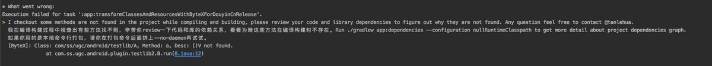
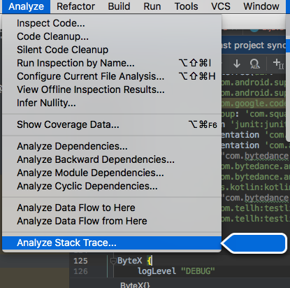
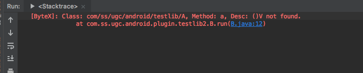
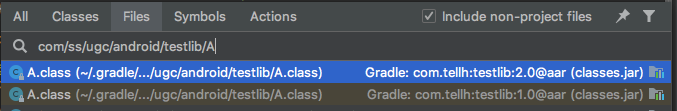
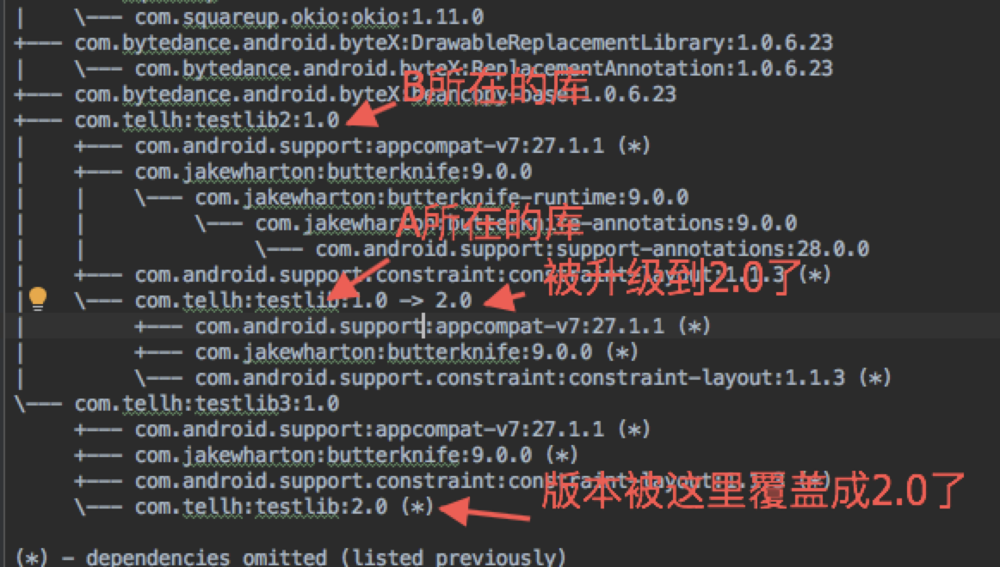

English | **[简体中文](README-zh.md)**

# refer-check-plugin

## feature

This plugin will detect all bytecode instructions,  to check if those illegal field references or method invocations exist.

- Invoking a method that does not existed;
- Invoking a method that is not accessible; (e.g. Calling a private method of other class, or calling non-static method in static method.)
- Referring a field that does not existed;
- Referring a field that is not accessible; (e.g. Calling a private field of other class, or calling non-static field in static method.)

## usage

```groovy
classpath "com.bytedance.android.byteX:refer-check-plugin:${plugin_version}"
```

```groovy
apply plugin: 'bytex.refer_check'
refer_check {
    enable true
    enableInDebug false
    logLevel "INFO"
    strictMode true // to control whether to abort the build if no method does not exist
    // check whitelist. Class names and method names must be separated by a '#', and both support regular matching.
    whiteList = [
            "com/google/+", // Skip classes prefixed with 'com/google'
           // Skip checking the method named 'init' in the  class named 'com/tellh/Foo'
            "com/tellh/Foo#init",
           // Skip checking the method named 'init' in the inner class 'Abc' of 'com/tellh/Foo'. Don't forget the escape before '$'.
            "com/tellh/Foo\$Abc#init",
    ]
}
```

## error log

For example, in general, the error log will look like this:



First, copy all these logs above and paste them into the 'Analyze Stack Trace' of AndroidStudio.






👆What do those logs mean? It says that in the class "com.ss.ugc.android.plugin.testlib2.B", there is a method named "run", calling the method of the class named "com/ss/ugc/android/testlib/A", in line 12 (we can click on the blue link to locate that line).  And the method named "a" of the class named "com/ss/ugc/android/testlib/A" has no parameters and no return value. However, this method does not exist! Why?

.png)

To figure out this problem, we should find out where is the class named "com/ss/ugc/android/testlib/A".




OK, it's from the aar named "com/ss/ugc/android/testlib/A在com.tellh:testlib".

For methods that don’t exist, there are two possible causes of this problem.

- The first is that the "com.tellh: testlib" library is not included in the build process. For example, this library is "compileOnly" or is excluded from the dependencies. In this case, such a tip usually appears in the error log.

```
Tips: class [com/ss/ugc/android/testlib/A] was not packaged, please checkout if it was 'compileOnly' or excluded by some dependencies.
```

- The second is the "com.tellh: testlib" library, which is depended on many places and upgraded to other versions. In that higher version, the method named "a" in the class "com/ss/ugc/android/testlib/A" (no return value  and no parameter) does not exist.

If it is confirmed to be the second one, then you need to review the Gradle dependency of your project and execute it on the command line:


```
./gradlew app:dependencies --configuration ${variantName}RuntimeClasspath > dep.txt
```

If no flavor, then just execute:

```
./gradlew app:dependencies --configuration releaseRuntimeClasspath > dep.txt
```

The dependency tree will be output to the file dep.txt, then you can search for the library "com.tellh: testlib", and see where this library is depended.




Let's take a look at "com.tellh: testlib: 2.0" and see if the method named  "a" in class "com/ss/ugc/android/testlib/A" (no parameters and no return value) exists.


The truth is clear. It turns out that in aar "com.tellh: testlib: 2.0", the method named "a" in the class "com/ss/ugc/android/testlib/A" has been added with an int type parameter.
