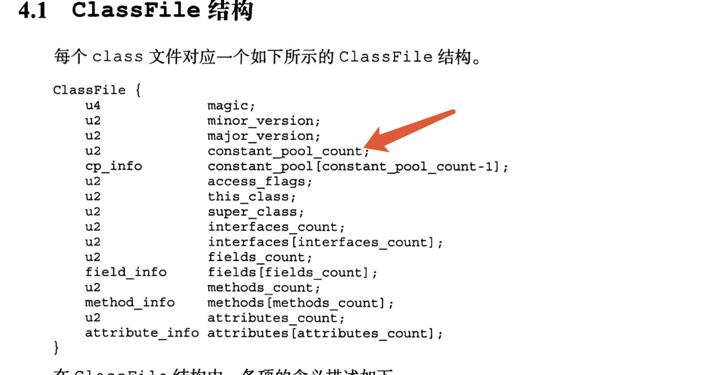
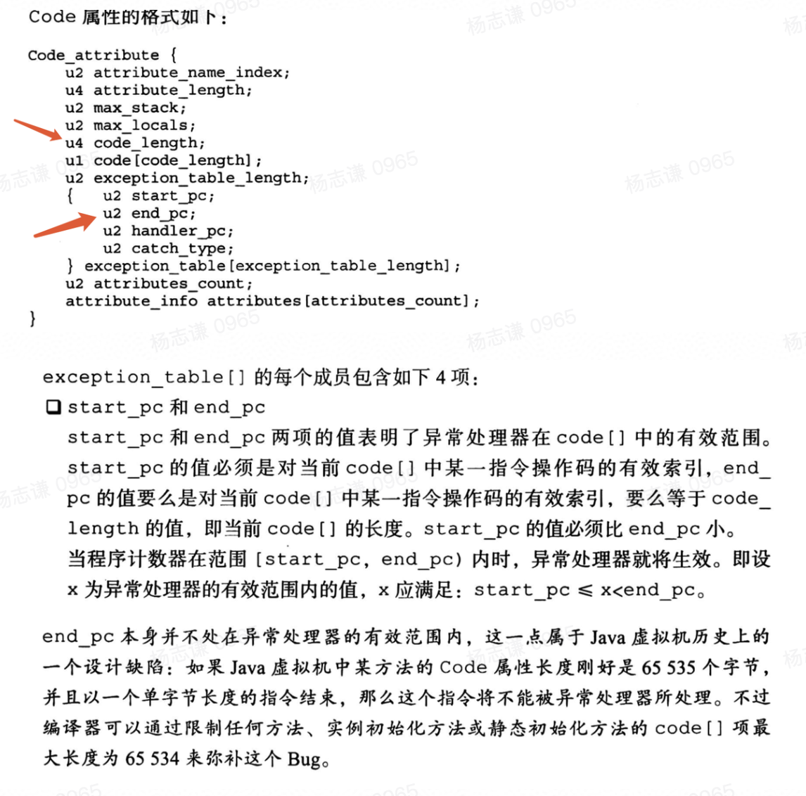
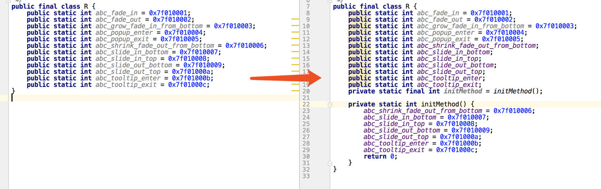
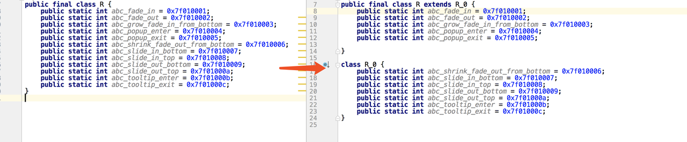

[English](RFileKnife-README.md) | 简体中文

## 目的
&emsp;&emsp;修复因为项目带有太多的资源导致生成的R.java的中字段数量太多致使javac报错 `code too large`的问题，报错堆栈类似下面所示:<br/>
> /root/workspace/xxxx/main/build/generated/not_namespaced_r_class_sources/douyinCnRelease/generateDouyinCnReleaseRFile/out/com/ss/android/ugc/aweme/R.java:21511: error: code too large  public static int abc = 0x7f150001;

## 问题原因

### 原因一:常量池溢出
&emsp;&emsp;Java代码中每一个符号、字段、方法都会在Class结构中常量池中占用一个索引，而一个class中的常量索引有65535的限制，可以在Class文件结构中知道:<br/>
<Br/>
&emsp;&emsp;此时我们可以去反推一个`public static int xxx = yyy`所占用的常量池大小为4个:

1. Utf8一个:也就是字段名xxx
2. Fieldref 一个: 非final R字段需在类初始化块中加上赋值指令，putstatic指令带入该常量
3. NameAndType一个: Fieldref引入
4. Integer: 非final R字段需在类初始化块中加上赋值指令，putstatic指令带入该常量,也就是yyy

&emsp;&emsp;另外，如果R在application的module中，R为public static final int xxx = yyy;此时xxx为常量字段，并不需要初始化赋值指令，赋值通过字段的属性完成，一个public static final int xxx = yyy所占用的常量池大小为2个:

1. Utf8一个:也就是字段名xxx
2. Integer: 属性表引入，也就是yyy

&emsp;&emsp;结论:因常量池限制，刨除class自有的常量数量计算，Library中的单种类型的资源数量不得超过16378,Application中的单种类型的资源数量不得超过32760。
    
### 原因二:方法指令数溢出
&emsp;&emsp;非final的字段存在赋值代码时会在(类)构造方法中产生对应的赋值语句.一个赋值过程需要6个字节(ldc_w+putstatic)的指令长度，而一个方法的指令大小上限为65535:<br/>
<Br/>
&emsp;&emsp;所以如果一个类中存在10943个以上的非static final赋值字段时将导致类构造方法指令数溢出，在javac时出现code too large。

## 解决方案
&emsp;&emsp;核心思想:拆分Java代码,插件实现了两种方案

### 方案一:对赋值进行切割
&emsp;&emsp;原理是将原来的类初始化代码中放不下的一部分字段初始化放到其他单独一个方法中，这里构造出一个类似的initMethod字段和initMethod方法，将多余的字段初始化代码放进去，这样在保证原代码逻辑的同时绕过方法内65535的限制。效果类似下图:<br/>
<Br/>
&emsp;&emsp;缺陷:此时不会出现方法内指令65535的问题(一个initMethod不够可以再构造几个)，但此时还有另外一个限制就是上面常量池限制的问题，一个字段需要4个常量池，所以该方案的字段最大上限将变成16378个<br/>
### 方案二:对字段进行Class继承切割
&emsp;&emsp;对字段进行Class继承切割是将所有的字段切到多个class中，然后用继承的方式来包含所有的字段值，该方案可以使得字段无限扩容(单层继承不行就扩展到多个)，效果类似下图：<br/>
<Br/>
&emsp;&emsp;弊端:需要兼容现有的ByteX的ShrinkR插件,注意反射的R字段的情况.<br/>

## Q&A
- Q:为什么先出问题的是library而不是app?

> A:app下的R中的id是public static final int,不会有赋值指令，一个字段只需要两个常量数量(上限32760)，但library下的是public static int，一个字段需要6个字节赋值指令(上限10943)

- Q:修改R.java的代码会对ButterKnife的R2有影响吗？

> A:不会，R2的生成并不是直接复制R.java的代码再生成final的版本，而是读取processResourcesTask的textSymbolOutputFile文件再用javapoet生成新的R2.java文件，id的值是重新生成的。也不会与R.java有任何交集.

- Q:方案二是否会与constraintlayout有冲突?

> A:不会，constraintlayout使用的是先使用`Class.getField(String)`反射字段值，失败后再`Resource.getIdentifier`去获取id,插件对这两种情况均不产生影响。

## 接入方式

* 添加classpath(和ShrinkR相同)

  >classpath "com.bytedance.android.byteX:shrink-r-plugin:${plugin_version}"
* 在Library或者Application的build.gradle中apply插件

    ```groovy
    apply plugin: "bytex.RFileKnife"
        RFileKnife {
        //限制一个R.XXX中有多少个字段 默认10000,请不要超过10953,也不能太低(500)，否则数组无法容下，默认值最好
        limitSize 10000
        //分割方法  value|inherit 默认value ；inherit模式需要shrinkR开启compatRFileAssignInherit
        assignType "inherit"
        //是否做一次校验，防止兼容性问题 默认false
        verifyParse true
        //默认只对当前module的package的R.java进行处理，其他package需要配置.
        packageNames = [
            //"com.ss.android.ugc.aweme",
        ]
        //inherit模式时不被挪动的字段，有反射时需要配置
        whiteList = [
            // style/abc
            // abc
        ]
    }
    ```