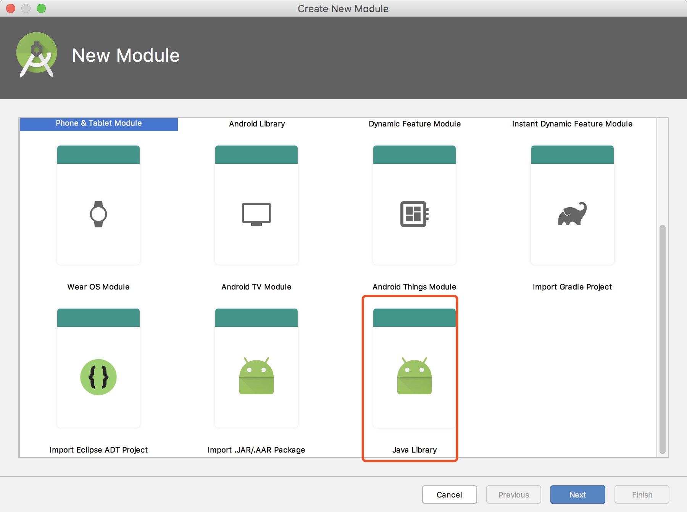
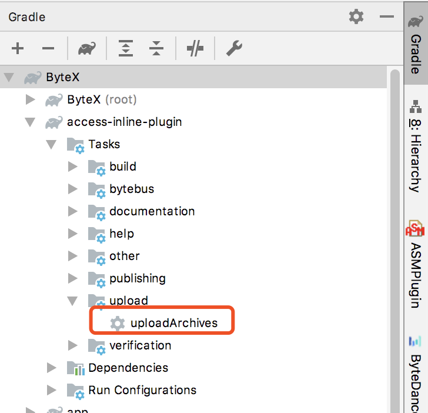
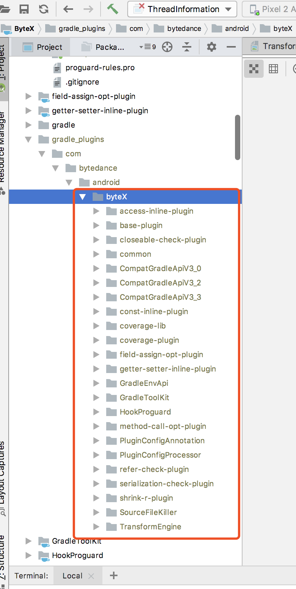
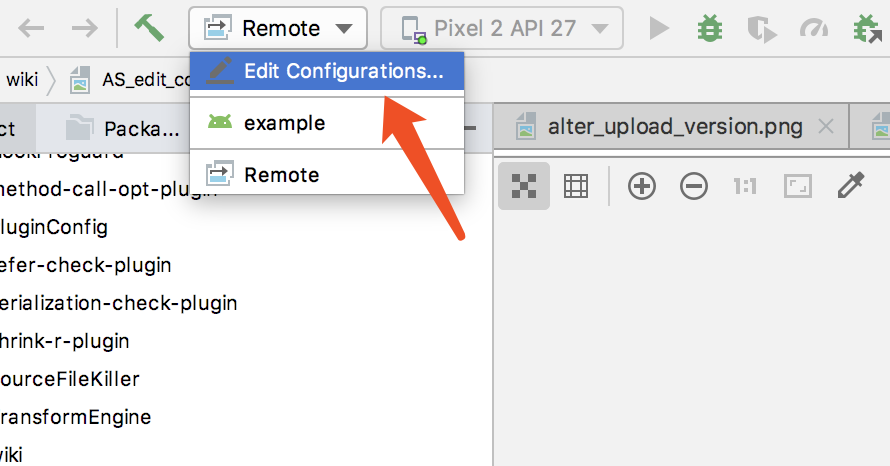
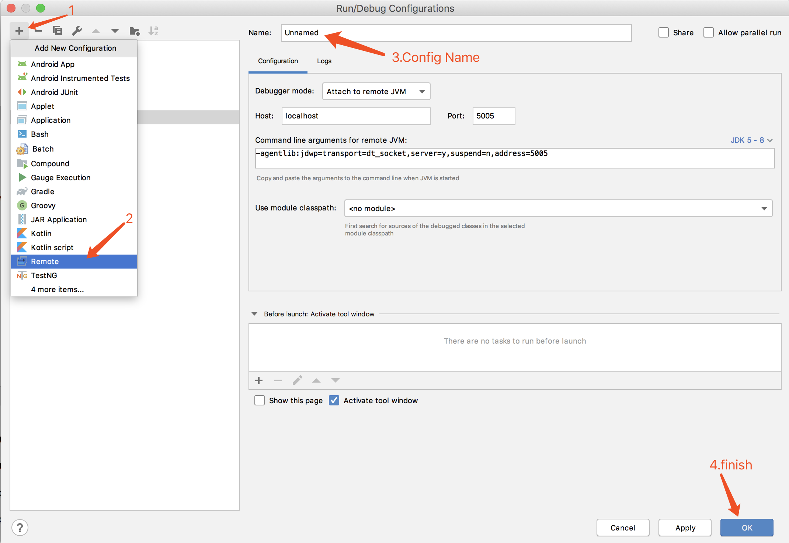
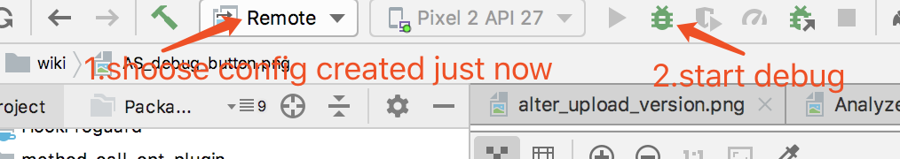
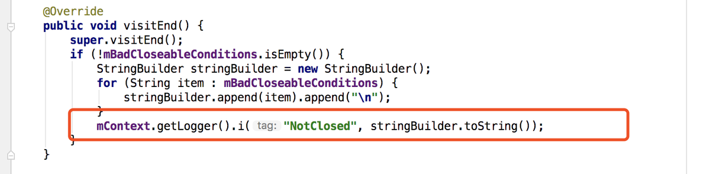
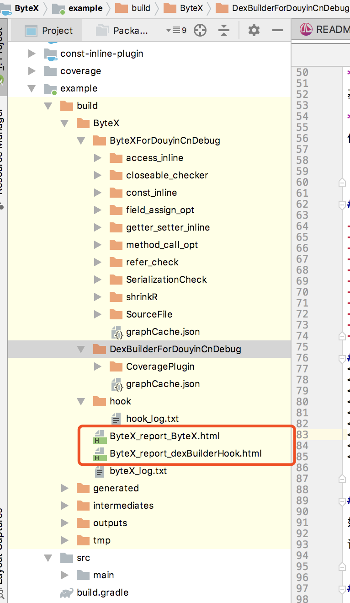

[English](ByteX-Developer-API-en.md) | **[简体中文](ByteX-Developer-API-zh.md)**
## Quick Start 快速上手

### 环境搭建
- 首先把工程代码clone到本地,<https://github.com/bytedance/ByteX>,checkout一个feature分支做开发.
- ByteX的代码组织是一个module对应一个plugin,每个plugin的代码相互独立,相互隔离.因此,要开发一个新插件,你需要新建一个Java Library module.

<Br/>

- 新建完module后,配置插件的build.gradle(插件的名字就是module的名字,插件的名字规范请参考 下面的开发注意事项-开发规范)

```groovy
//使用通用的依赖和发布方式
apply from: rootProject.file('gradle/plugin.gradle')
//如果module需要单独添加依赖则添加下面的
dependencies {
    compile project(':TransformEngine')
    implementation "br.usp.each.saeg:asm-defuse:0.0.5"
}
```
&nbsp;&nbsp;&nbsp;&nbsp;&nbsp;&nbsp;这样工程框架就搭建好了.

### 自定义Plugin

- 基于ByteX开发新插件,我们最少只需要创建两个类.

1. 一个是Extension,它是一个数据结构,对应于插件在app工程里的配置信息.
2. 一个是Plugin,它务必实现Plugin<Project>接口.当然,对于简单的插件,直接继承抽象类AbsMainProcessPlugin或者CommonPlugin就是省事的做法了.下面是一个简单的例子：

```java
//@PluginConfig("bytex.sourcefile")
public class SourceFileKillerPlugin extends CommonPlugin<SourceFileExtension, SourceFileContext> {
    @Override
    protected SourceFileContext getContext(Project project, AppExtension android, SourceFileExtension extension) {
        return new SourceFileContext(project, android, extension);
    }

    @Override
    public boolean transform(@Nonnull String relativePath, @Nonnull ClassVisitorChain chain) {
        //我们需要修改字节码,所以需要注册一个ClassVisitor
        //We need to modify the bytecode, so we need to register a ClassVisitor
        chain.connect(new SourceFileClassVisitor(extension));
        return super.transform(relativePath, chain);
    }

    @Nonnull
    @Override
    public TransformConfiguration transformConfiguration() {
        return new TransformConfiguration() {
            @Override
            public boolean isIncremental() {
                //插件默认是增量的,如果插件不支持增量,需要返回false
                //The plugin is incremental by default.It should return false if incremental is not supported by the plugin
                return true;
            }
        };
    }
}
```

- 创建好Plugin类后,我们需要让gradle能够识别到我们的plugin.我们有两种配置方式.
1. 可以用注解的方式
```
@PluginConfig("bytex.sourcefile")
public class SourceFileKillerPlugin extends CommonPlugin<SourceFileExtension, SourceFileContext> {...}
```
2. 传统的properties<br/>
&nbsp;&nbsp;&nbsp;&nbsp;&nbsp;&nbsp;需要在resource目录创建一个properties文件.properties文件的文件名对应于插件的id,可以随意起但务必保证在工程中的唯一性.例如下图中,properties文件名是bytex.sourcefile.properties,那么在app工程里要引用这个插件时就需要这样配置：

<Br/>

&nbsp;&nbsp;&nbsp;&nbsp;&nbsp;&nbsp;在properties文件里需要配置我们的Plugin类的全类名（包名+类名）,例如：

```properties
implementation-class=com.ss.android.ugc.bytex.sourcefilekiller.SourceFileKillerPlugin
```
&nbsp;&nbsp;&nbsp;&nbsp;&nbsp;&nbsp;那么在app工程里要引用这个插件时就需要这样配置：

```groovy
apply plugin: 'bytex.sourcefile'
```
&nbsp;&nbsp;&nbsp;&nbsp;&nbsp;&nbsp;至此,我们的新插件初现雏形了,但要让我们的插件处理class文件,需要定义相应的ClassVisitor或者直接操作ClassNode.

### 插件发布

- 本地发布

&nbsp;&nbsp;&nbsp;&nbsp;&nbsp;&nbsp;直接在工程根目录执行脚本

```
./publish.sh
```

&nbsp;&nbsp;&nbsp;&nbsp;&nbsp;&nbsp;或者双击uploadArchives即可将插件发布到本地工程的gralde_plugins目录.

<Br/>

<Br/>
&nbsp;&nbsp;&nbsp;&nbsp;&nbsp;&nbsp;每次修改插件源码,都需要本地打包发布一下才能生效.

- 线上发布

&nbsp;&nbsp;&nbsp;&nbsp;&nbsp;&nbsp;如果我们的插件在本地开发并自测完成后,需要将插件发布到线上的公司maven,方便集成到实际项目的当中.

&nbsp;&nbsp;&nbsp;&nbsp;&nbsp;&nbsp;首先在ByteX的根目录下新建（如果有就不用新建了）一个local.properties的配置文件,添加如下配置：

```
UPLOAD_MAVEN_URL=xxx
UPLOAD_MAVEN_URL_SNAPSHOT=xxx
USERNAME=xxx
PASSWORD=xxx
USERNAME_SNAPSHOT=xxx
PASSWORD_SNAPSHOT=xxx
```

&nbsp;&nbsp;&nbsp;&nbsp;&nbsp;&nbsp;然后,修改ext.gradle里的upload_version.


&nbsp;&nbsp;&nbsp;&nbsp;&nbsp;&nbsp;同样地,执行脚本(或者双击uploadArchives即可将插件发布到线上maven.)

```
./publish.sh -m
```
- 发布到snapshot
 &nbsp;&nbsp;&nbsp;&nbsp;&nbsp;&nbsp;version=$当前版本号-${user.name}--SNAPSHOT
 
```
./publish.sh -m -t
```

### 插件调试

&nbsp;&nbsp;&nbsp;&nbsp;&nbsp;&nbsp;在AndroidStudio新建run configuration.

<Br/>

<Br/>

&nbsp;&nbsp;&nbsp;&nbsp;&nbsp;&nbsp;把插件本地发布然后接入到app工程里之后,在命令行执行构建命令,末尾拼上这一串参数,比如：

```
gradle clean :aweme:assembleRelease -Dorg.gradle.debug=true --no-daemon
```

&nbsp;&nbsp;&nbsp;&nbsp;&nbsp;&nbsp;然后切换到刚刚创建的Configuration,点击debug按钮.

<Br/>


### 示例demo

&nbsp;&nbsp;&nbsp;&nbsp;&nbsp;&nbsp;SourceFileKiller是一个自定义插件,代码比较少,可以当做示例demo.它做的事情很简单.删除字节码中的SourceFile与行号信息

<Br/>

### 外部工程
&nbsp;&nbsp;&nbsp;&nbsp;&nbsp;&nbsp;如果需要在外部工程,基于ByteX开发插件,只需要引入common依赖即可.

```groovy
compile "com.bytedance.android.byteX:common:${bytex_version}"
```

&nbsp;&nbsp;&nbsp;&nbsp;&nbsp;&nbsp;如果想用注解的方式注册插件,可以引入以下依赖(非必须):

```groovy
compile "com.bytedance.android.byteX:PluginConfigProcessor:${bytex_version}"
kapt "com.bytedance.android.byteX:PluginConfigProcessor:${bytex_version}"
```

## Primary API

### ASM处理class文件

&nbsp;&nbsp;&nbsp;&nbsp;&nbsp;&nbsp;由于ByteX的上层封装是基于ASM的,因此我们处理class文件时,可以通过注册ClassVisitor或者直接操作ClassNode的方式来对class文件进行读写操作.(如果你需要接收文件的byte code作为输入,可以参考下面的Advanced API).

&nbsp;&nbsp;&nbsp;&nbsp;&nbsp;&nbsp;默认地,ByteX所形成的Transform对Class文件至少有一个常规处理过程（MainProcess）,包括以下步骤：

1. traverse过程：遍历一次工程中所有的构建产物（一般来说是class文件）,单纯做遍历分析,不对输入文件做修改；
2. traverseAndroidJar过程：遍历android.jar里的所有class文件 （哪个版本的android.jar由工程中的target api决定）,主要是为了形成完整的类图.
3. 最后一步transform：再遍历一次工程中所有的构建产物,并对class文件做处理后输出（可能是直接回写到本地,也可能作为下一个处理过程的输入）.

&nbsp;&nbsp;&nbsp;&nbsp;&nbsp;&nbsp;由此可以看出,一次常规处理过程,会遍历两次工程构建中的所有class.事实上,这样的处理过程我们抽象成一个TransformFlow,开发者可以通过自定义TransformFlow来定制工作流的处理步骤（比如,多次traverse,或者只做transform不做traverse等等）,具体请参考Advanced API.

&nbsp;&nbsp;&nbsp;&nbsp;&nbsp;&nbsp;回到我们之前新建的Plugin类,它是直接继承自CommonPlugin的,如果我们需要在transform阶段（对应上面的第三步）处理class文件,Plugin类需要Override下面两个方法的一个：

```java
/**
 * transform 工程中的所有class
 *
 * @param relativePath class的相对路径
 * @param chain        ClassVisitorChain用于注册自定义的ClassVisitor
 * @return if true, 这个class文件会正常输出；if false, 这个class文件会被删除
 */
@Override
public boolean transform(String relativePath, ClassVisitorChain chain) {
    chain.connect(new HookFlavorClassVisitor(context));
    return true;
}
/**
 * transform 工程中的所有class
 *
 * @param relativePath class的相对路径
 * @param node         class的数据结构（照顾喜欢用tree api的同学）.
 * @return if true, 这个class文件会正常输出；if false, 这个class文件会被删除
 */
@Override
public boolean transform(String relativePath, ClassNode node) {
    // do something with ClassNode
    return true;
}
```

&nbsp;&nbsp;&nbsp;&nbsp;&nbsp;&nbsp;我们可以看到,这两个重载方法的区别在于他们的输入参数,前者用的是ASM的ClassVisitor,后者用的是ASM 的Tree API,可以直接处理ClassNode.

&nbsp;&nbsp;&nbsp;&nbsp;&nbsp;&nbsp;同理,如果我们需要需要在traverse阶段,分析class文件,Plugin类可以复写下面的方法：

```java
    /**
     * 遍历工程中所有的class
     *
     * @param relativePath class的相对路径
     * @param chain        ClassVisitorChain用于加入自定义的ClassVisitor
     */
    void traverse(@Nonnull String relativePath, @Nonnull ClassVisitorChain chain);

    /**
     * 遍历工程中所有的class
     *
     * @param relativePath class的相对路径
     * @param node         class的数据结构（照顾喜欢用tree api的同学）.
     */
    void traverse(@Nonnull String relativePath, @Nonnull ClassNode node);
```

### Log日志

&nbsp;&nbsp;&nbsp;&nbsp;&nbsp;&nbsp;bytex对于对项目的每一处修改都要求产生一条日志,以便查询修改和后面的问题定位.bytex的日志设计是基于模块划分的,也就是每一个plugin的日志应该单独记录在一个日志文件中,这个已经封装好了,开发者只需和平常的Log调用一样拿来使用即可.

&nbsp;&nbsp;&nbsp;&nbsp;&nbsp;&nbsp;需要记录日志时直接从Context获取Logger对象并调用相应的方法.



&nbsp;&nbsp;&nbsp;&nbsp;&nbsp;&nbsp;对应的日志会记录在app/build/ByteX/${variantName}/${extension_name}/${logFile}文件中.如果在gradle中没有配置logFile参数,文件名则会使用${extension_name}_log.txt.<br/>
&nbsp;&nbsp;&nbsp;&nbsp;&nbsp;&nbsp;bytex同时会生成一份可视化的html日志(多个transform会有多个html),这个页面的数据来源于每一个plugin,不需要开发者关心,自动生成.文件名为app/build/ByteX/ByteX_report_{transformName}.html.

<Br/>

&nbsp;&nbsp;&nbsp;&nbsp;&nbsp;&nbsp;建议:如果插件需要生成其他文件信息,可以放在context.buildDir()目录中,这个目录对应`app/build/ByteX/${extension_name}/` 文件路径


## Advanced API

### TransformFlow

&nbsp;&nbsp;&nbsp;&nbsp;&nbsp;&nbsp;为了给基于ByteX开发的插件提供更多的灵活性.我们引入了TransformFlow的概念.

&nbsp;&nbsp;&nbsp;&nbsp;&nbsp;&nbsp;处理全部的构建产物（一般为class文件）的过程定义为一次TransformFlow.一个插件可以独立使用单独的TransformFlow,也可以搭车到全局的MainTransformFlow（traverse,traverseAndroidJar,transform形成一个MainTransformFlow）.

&nbsp;&nbsp;&nbsp;&nbsp;&nbsp;&nbsp;要为插件自定义TransformFlow,我们需要复写IPlugin的provideTransformFlow方法.

```java
// 搭车到全局的MainTransformFlow, 大多数插件的做法
@Override
protected TransformFlow provideTransformFlow(@Nonnull MainTransformFlow mainFlow, @Nonnull TransformContext transformContext) {
    return mainFlow.appendHandler(this);
}
// 插件独立于全局的MainTransformFlow,关联于新的MainTransformFlow
@Override
protected TransformFlow provideTransformFlow(@Nonnull MainTransformFlow mainFlow, @Nonnull TransformContext transformContext) {
    return new MainTransformFlow(transformer, new BaseContext(project, android, extension));
}
// 插件独立于全局的MainTransformFlow,关联于新的自定义Flow
@Override
protected TransformFlow provideTransformFlow(@Nonnull MainTransformFlow mainFlow, @Nonnull TransformContext transformContext) {
    return new AbsTransformFlow(transformer, new BaseContext(project, android, extension)) {
        @Override
        protected AbsTransformFlow beforeTransform(Transformer transformer) {
            return this;
        }
    
        @Override
        protected AbsTransformFlow afterTransform(Transformer transformer) {
            return this;
        }
    
        @Override
        public void run() throws IOException, InterruptedException {
            // do something in flow.
        }
    };
}
```


### 类图Graph的获取

&nbsp;&nbsp;&nbsp;&nbsp;&nbsp;&nbsp;理论上每一个TransformFlow都可能存在一个包含项目代码中的java类、依赖库中的java类和android.jar中的java类类图数据,这个和你TransformFlow的实现有关.<br/>
&nbsp;&nbsp;&nbsp;&nbsp;&nbsp;&nbsp;当你使用MainTransformFlow时(默认情况就是这个TransformFlow),在执行完traverse(包含traverseArtifactOnly和traverseAndroidJarOnly)后,插件会自动生成本次TransformFlow的类图数据,这个数据将会放在对应的Context对象中.你可以使用context.getClassGraph()方法获取类图对象.

```java
public class BaseContext<E extends BaseExtension> {
    protected final Project project;
    protected final AppExtension android;
    public final E extension;
    private ILogger logger;
    private Graph classGraph;//类图对象
    ...
    public Graph getClassGraph() {
        return classGraph;
    }
}
```

&nbsp;&nbsp;&nbsp;&nbsp;&nbsp;&nbsp;注意点:

- 在TransformFlow没有完成traverse任务(准确的说是在CommonPlugin的beforeTransform)的情况下类图是不存在,获取类图的对象将会为null.<br/>
- 每一个继承自CommonPlugin的插件如果复写了beforeTransform方法必须调用对应super方法,否则类图对象不会传递到当前插件的Context对象中.<br/>
- 两个TransformFlow的类图隔离.因为每一个TransformFlow正常情况下都会对class修改,所以一般两个TransformFlow产生的类图也是不一样的.

### 文件查找能力
&nbsp;&nbsp;&nbsp;&nbsp;&nbsp;&nbsp;ByteX提供了基础的INPUT读取与输出能力,如果有需求获取transform输入、project输入、aar输入等信息,可以借助Engine层提供的数据接口获取对应的文件输入.

&nbsp;&nbsp;&nbsp;&nbsp;&nbsp;&nbsp;比如需要获取transform的所有输入:

```
context.getTransformContext().allFiles()
```
&nbsp;&nbsp;&nbsp;&nbsp;&nbsp;&nbsp;比如需要获取merge之后的resource文件:

```
context.getTransformContext().getArtifact(Artifact.MERGED_RES)
```
&nbsp;&nbsp;&nbsp;&nbsp;&nbsp;&nbsp;比如需要查找某class的原始位置:

```
context.getTransformContext().getLocator().findLocation("${className}.class",SearchScope.ORIGIN)
```


### MainProcessHandler

&nbsp;&nbsp;&nbsp;&nbsp;&nbsp;&nbsp;MainProcessHandler绑定于MainTransformFlow的处理器,每个步骤处理的每个class都会回调MainProcessHandler的相应方法进行处理.一般我们自定义的插件都已经实现了这个接口,开发者可以直接复写相应的方法来获取相应的回调.

- MainProcessHandler接口里面,init,traverse,transform的系列方法都是通过ASM处理class文件的,为了提供更大的灵活性,可以通过复写`List<FileProcessor> process(Process process)`方法,注册自己的FileProcessor来处理,以获得更大的灵活性.

- MainProcessHandler接口还有flagForClassReader方法,复写它可以自定义ClassReader调用accept方法读取class文件时传进去的flag,默认值是`ClassReader.SKIP_DEBUG` | `ClassReader.SKIP_FRAMES`.

### FileProcessor

&nbsp;&nbsp;&nbsp;&nbsp;&nbsp;&nbsp;如果开发者不想用ASM封装的上层接口来处理class文件,ByteX也提供了更加底层的API.<br/>
&nbsp;&nbsp;&nbsp;&nbsp;&nbsp;&nbsp;FileProcessor类似于OkHttp的拦截器设计,每个class文件都会流经一系列的FileProcessor来处理.用这个接口的好处是,灵活！ 作为一个拦截器,你可以让后面的FileProcessor先处理完后再处理,甚至可以不传给下面的FileProcessor处理.

```java
public interface FileProcessor {
    Output process(Chain chain) throws IOException;
    interface Chain {
        Input input();
        Output proceed(Input input) throws IOException;
    }
}

public class CustomFileProcessor implements FileProcessor {
    @Override
    public Output process(Chain chain) throws IOException {
        Input input = chain.input();
        FileData fileData = input.getFileData();
       	// do something with fileData
        return chain.proceed(input);
    }
}
```

&nbsp;&nbsp;&nbsp;&nbsp;&nbsp;&nbsp;注册自定义的FileProcessor,我们也提供了更加简便的注解方式,在自定义的Plugin上通过注解`@Processor`来注册FileProcessor.

```java
@Processor(implement = CustomFileProcessor.class)
@Processor(implement = CustomFileProcessor.class, process = Process.TRAVERSE)
public class FlavorCodeOptPlugin extends CommonPlugin<Extension, Context> {...}
```


### FileHandler

&nbsp;&nbsp;&nbsp;&nbsp;&nbsp;&nbsp;FileHandler是FileProcessor再往上封装的接口,接受的输入参数是FileData,FileData内包含文件的bytecode.

```java
public interface FileHandler {
    void handle(FileData fileData);
}
public class CustomFileHandler implements FileHandler {
    @Override
    public void handle(FileData fileData) {
       	// do something with fileData
    }
}
```

&nbsp;&nbsp;&nbsp;&nbsp;&nbsp;&nbsp;注册自定义的FileHandler,跟FileProcessor一样,我们也提供了更加简便的注解方式,在自定义的Plugin上通过注解`@Handler`来注册FileHandler.

```java
@Handler(implement = CustomFileHandler.class)
@Handler(implement = CustomFileHandler.class, process = Process.TRAVERSE)
public class FlavorCodeOptPlugin extends CommonPlugin<Extension, Context> {...}
```

### TransformConfiguration

&nbsp;&nbsp;&nbsp;&nbsp;&nbsp;&nbsp;这个接口里的方法都对应于Transform API里面的Transform接口里的方法.<br/>
&nbsp;&nbsp;&nbsp;&nbsp;&nbsp;&nbsp;每个IPlugin插件可通过复写transformConfiguration接口方法,来自定义一些配置.<br/>
&nbsp;&nbsp;&nbsp;&nbsp;&nbsp;&nbsp;比如,在AwemeSpiPlugin里,

```java
@Override
public TransformConfiguration transformConfiguration() {
    return new TransformConfiguration() {
        @Override
        public Set<QualifiedContent.ContentType> getInputTypes() {
            return TransformManager.CONTENT_JARS;
        }
    };
}
```

### hook transform顺序

&nbsp;&nbsp;&nbsp;&nbsp;&nbsp;&nbsp;依靠android的transform api registerTransform 只能把你的transform 注册到proguard,dex等内置transform之前,如果想让插件在proguard之后做些事情,就需要一些反射hook的手段.ByteX的IPlugin接口提供了一个hookTransformName方法,只需要复写这个方法,并返回你需要hook的transform的名字,那么你的插件就能在紧挨着这个transform之前执行.<br/>
&nbsp;&nbsp;&nbsp;&nbsp;&nbsp;&nbsp;比如,如果你想让你的插件在proguard之后被执行（即在紧挨dex之前）,可以这么做：

```java
public class DoAfterProguardPlugin extends CommonPlugin<Extension, Context> {
    @Override
    public String hookTransformName() {
        return "Dex";
    }
}
```
### 额外添加文件

&nbsp;&nbsp;&nbsp;&nbsp;&nbsp;&nbsp;如果需要在transform的时候,额外输出一些文件,可以复写beforeTransform方法,调用TransformEngine所提供的addFile方法.

```
    @Override
    public void beforeTransform(@Nonnull @NotNull TransformEngine engine) {
        super.beforeTransform(engine);
        engine.addFile("affinity",new FileData("addFile test".getBytes(),"com/ss/android/ugc/bytex/test.txt"));
    }
```

&nbsp;&nbsp;&nbsp;&nbsp;&nbsp;&nbsp;addFile的第一个参数affinity,可以随意设定.如果两次addFile调用的affinity是一致的话,那么这两个文件将会在同一个输出目录里.


### Incremental增量编译

&nbsp;&nbsp;&nbsp;&nbsp;&nbsp;&nbsp;ByteX的插件默认使用增量编译,如果你的插件不能支持增量模式,请在插件中声明不使用增量构建,声明方式如下:

```java
public class SourceFileKillerPlugin extends CommonPlugin<SourceFileExtension, SourceFileContext> {
    @Nonnull
    @Override
    public TransformConfiguration transformConfiguration() {
        return new TransformConfiguration() {
            @Override
            public boolean isIncremental() {
                //插件默认是增量的,如果插件不支持增量,需要返回false
                //The plugin is incremental by default.It should return false if incremental is not supported by the plugin
                return true;
            }
        };
    }
    ...
}
```
## 开发注意事项
### 分支管理
&nbsp;&nbsp;&nbsp;&nbsp;&nbsp;&nbsp;对于新功能,原则上只能从develop分支上拉出来,当需要合入到主干分支,需要先合入到develop分支,后面统一合入到master分支.<br/>
&nbsp;&nbsp;&nbsp;&nbsp;&nbsp;&nbsp;对于简单的bugfix,可以直接从master分支拉出修改,往master分支提交mr.当mr被合入后,需要再次提交一个master->develop分支的mr以同步修改.
### 开发规范
  - module名字<br/>
&nbsp;&nbsp;&nbsp;&nbsp;&nbsp;&nbsp;统一全部小写,多个单词之间用"-"(中划线)分割.如果是插件module,请以"-plugin"结尾,如果一个功能既包含插件module,又包含运行时依赖库("java或者library")时,请将这几个module放在ByteX根目录中的同一个目中,避免一个功能分散在byteX的根目录下.
  - 包名<br/>
    &nbsp;&nbsp;&nbsp;&nbsp;&nbsp;&nbsp;所有的包名必须以"com.ss.android.ugc.bytex"开始,然后后面一级使用一个代表功能的包名以示区分.
  - 注释<br/>
   &nbsp;&nbsp;&nbsp;&nbsp;&nbsp;&nbsp;建议对复杂或者核心的代码编写注释,注释推荐使用英文.
  - 文档<br/>
    &nbsp;&nbsp;&nbsp;&nbsp;&nbsp;&nbsp;极力建议在插件写完并上线后,完善文档,文档包含中英两份,均放置到对应插件的module下.sp;原则上aweme上所有插件版本必须统一使用同一个版本号，为了版本不存在歧义,原则上发布正式版本时版本号只能包含四个数字的组合,用"."分隔